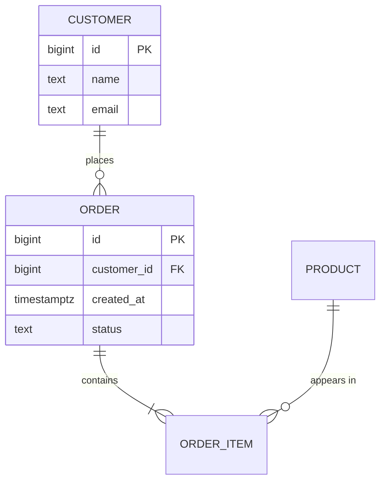

# Database Modeling

## Intro

A good schema is shaped by access patterns, invariants, and expected
growth — not by the first ER diagram that comes to mind. Start from
the requirements, normalize to 3NF, and only denormalize against a
measured problem with a documented sync strategy.

## Overview

### Gather requirements first

Before drawing any schema, pin down five things:

1. **Entities and relationships** — what are the nouns and how do
   they relate?
2. **Cardinality** — one-to-one, one-to-many, many-to-many?
3. **Access patterns** — what queries run most often, and what is
   the read/write ratio?
4. **Data volume** — rows per table now and in two years?
5. **Consistency requirements** — which invariants must the database
   itself enforce?

### Conceptual model

Start with an ER diagram. Mermaid keeps it text-based and reviewable:



Notation: `||` = exactly one, `o{` = zero or more, `|{` = one or
more.

### Normalize to 3NF

- **1NF** — every column holds a single atomic value. No arrays,
  comma-separated lists, or repeating groups.
- **2NF** — every non-key column depends on the entire primary key
  (relevant for composite keys).
- **3NF** — no transitive dependencies. Non-key columns depend only
  on the key.

Test each table with the rhyme: "every non-key column describes the
key, the whole key, and nothing but the key."

### Denormalize deliberately

Denormalize only when you can answer "yes" to all of:

- Have you measured a real performance problem?
- Is the duplicated data updated infrequently?
- Do you have a strategy to keep copies in sync (trigger, app code,
  scheduled job)?

Common techniques:

- **Summary tables** — precomputed aggregates refreshed on a
  schedule.
- **Embedded lookups** — store `category_name` alongside
  `category_id` to skip a join.
- **Materialized views** — database-managed denormalization with
  refresh control.

### Relationship patterns at a glance

| Pattern | Use when |
|---------|----------|
| Junction table | Many-to-many (standard) |
| Polymorphic associations | One table references multiple parent types |
| Single-table inheritance | Few subtypes, similar columns |
| Class-table inheritance | Many subtypes, different columns |
| Adjacency list | Simple tree, frequent edits |
| Nested sets | Read-heavy tree, rare updates |
| Materialized path | Tree with path queries / breadcrumbs |
| JSONB column | Sparse or schema-less attributes |

See `references/modeling-patterns.md` for full implementations.

### Plan for schema evolution

Schemas always change. Design for it:

- Add columns as nullable or with safe defaults — never lock the
  table.
- Prefer additive changes (new columns, new tables) over destructive
  ones.
- Version your API and your schema independently.
- Use expand/contract for non-trivial changes: add new structure,
  backfill, then remove the old.

## Gotchas

Agent-specific failure modes — provider-neutral pause-and-self-check items:

- **Premature denormalization for performance.** Denormalizing before you have measured a query performance problem introduces update anomalies — the same fact stored in multiple places must be kept in sync, and it will eventually drift. Model normalized first; denormalize only specific read paths after profiling shows the join is actually slow.
- **Storing monetary values as FLOAT or DOUBLE.** Floating-point types cannot represent most decimal fractions exactly, so `0.10 + 0.20` may evaluate to `0.30000000000000004`. Always use a fixed-point type (`DECIMAL`, `NUMERIC`) or store amounts as integer cents in the application's smallest currency unit.
- **Omitting foreign key constraints "for flexibility."** Foreign keys without database-enforced referential integrity allow orphaned rows to accumulate silently — orders with no customer, line items with no product. The constraint is not optional; it is the mechanism that makes the relationship reliable. Add them unless you have a specific, documented reason not to.
- **Comma-separated lists in a column.** Storing `"tag1,tag2,tag3"` in a TEXT column means queries must parse strings rather than use indexes, and adding or removing a value requires a string manipulation that cannot be done atomically. Use a junction table or, if the database supports it, an array or JSONB column with a GIN index.
- **Entity-Attribute-Value (EAV) tables without considering JSONB.** An EAV table (`entity_id`, `attribute_name`, `value`) is a hand-rolled sparse schema that requires joining for every attribute read and prevents meaningful indexing. Modern databases (PostgreSQL, MySQL 8) offer JSONB/JSON columns with indexes that achieve the same flexibility with far better query performance.
- **Not modeling for the actual access patterns.** A schema designed only from domain entities without considering how the application queries it often leads to expensive multi-table joins on the hot path. Before finalizing the schema, list the top 5 queries by frequency and write them out — then design the schema so each can use an index.
- **Storing hierarchies without choosing the correct hierarchy pattern.** Representing a tree with a naive `parent_id` self-reference makes querying all descendants require a recursive CTE or application-side recursion. For deep or frequently-traversed hierarchies, consider a closure table, nested sets, or ltree, depending on the read/write balance.

## Full reference

### Polymorphic associations

Three approaches when one table references rows in multiple parents:

**Type + ID columns (application-enforced):**

```sql
CREATE TABLE comments (
    id BIGINT GENERATED ALWAYS AS IDENTITY PRIMARY KEY,
    body TEXT NOT NULL,
    commentable_type TEXT NOT NULL,  -- 'post', 'image', 'video'
    commentable_id BIGINT NOT NULL,
    created_at TIMESTAMPTZ NOT NULL DEFAULT NOW()
);
CREATE INDEX idx_comments_target
    ON comments (commentable_type, commentable_id);
```

Simple, single table — but no foreign-key enforcement.

**Separate nullable foreign keys:**

```sql
CREATE TABLE comments (
    id BIGINT GENERATED ALWAYS AS IDENTITY PRIMARY KEY,
    body TEXT NOT NULL,
    post_id BIGINT REFERENCES posts(id),
    image_id BIGINT REFERENCES images(id),
    video_id BIGINT REFERENCES videos(id),
    CONSTRAINT chk_single_parent CHECK (
        (post_id IS NOT NULL)::int + (image_id IS NOT NULL)::int
        + (video_id IS NOT NULL)::int = 1
    )
);
```

Real foreign keys, but grows awkward beyond 3-4 parent types.

**Shared base table:** every parent has a row in
`commentable_entities`; the comment FK points there. Adds a join but
keeps integrity and stays extensible.

### Hierarchies

| Approach | Best for | Trade-off |
|---|---|---|
| Adjacency list (`parent_id`) | Frequent inserts/moves, shallow trees | Subtree queries need recursive CTEs |
| Nested sets (`lft`/`rgt`) | Read-heavy trees, deep subtree queries | Inserts/moves renumber many rows |
| Materialized path (`/1/4/10/`) | Breadcrumbs, prefix queries | Path updates cascade to descendants |

Adjacency list with a recursive CTE handles most application-level
hierarchies; reach for nested sets only when read patterns clearly
demand it.

### Temporal data

Track historical state with effective-time ranges:

```sql
CREATE TABLE prices (
    product_id BIGINT NOT NULL REFERENCES products(id),
    price DECIMAL(10,2) NOT NULL,
    valid_from DATE NOT NULL,
    valid_to DATE NOT NULL DEFAULT '9999-12-31',
    PRIMARY KEY (product_id, valid_from),
    EXCLUDE USING gist (
        product_id WITH =,
        daterange(valid_from, valid_to) WITH &&
    )
);
```

The `EXCLUDE` constraint prevents overlapping validity ranges for
the same product. Bi-temporal designs add a second range for
transaction time when you need to reconstruct what the system knew
at any point.

### Star schema for analytics

Separate facts (events/measures) from dimensions (descriptive
attributes):

```sql
CREATE TABLE dim_product (
    product_key SERIAL PRIMARY KEY,
    name TEXT, category TEXT
);
CREATE TABLE dim_date (
    date_key INT PRIMARY KEY,
    full_date DATE, year INT, quarter INT, month INT
);
CREATE TABLE fact_sales (
    sale_id BIGINT GENERATED ALWAYS AS IDENTITY,
    product_key INT REFERENCES dim_product,
    date_key INT REFERENCES dim_date,
    quantity INT NOT NULL,
    revenue DECIMAL(12,2) NOT NULL
);
```

Keep fact tables narrow (keys + measures); push descriptive
attributes into dimensions.

### JSONB for sparse attributes

Prefer JSONB over Entity-Attribute-Value tables when attributes vary
per row but do not need relational integrity:

```sql
ALTER TABLE products
    ADD COLUMN attributes JSONB NOT NULL DEFAULT '{}';
CREATE INDEX idx_products_attrs
    ON products USING GIN (attributes);

SELECT * FROM products WHERE attributes @> '{"color": "red"}';
```

Guidelines: keep JSONB to a handful of varying keys; if a key is
queried in every request, promote it to a real column; validate
structure in the application or with `CHECK` constraints.

### Polyglot persistence

Not everything belongs in a relational database — but default to
PostgreSQL until you have a measured reason otherwise.

| Data type | Storage |
|-----------|---------|
| Structured, relational, transactional | PostgreSQL, MySQL |
| Full-text search | Elasticsearch, PostgreSQL FTS |
| Session / cache | Redis |
| Time-series metrics | TimescaleDB, InfluxDB |
| Graph traversals | Neo4j (or recursive CTEs for simple cases) |
| Unstructured documents | MongoDB, or JSONB in PostgreSQL |
| Event streams | Kafka, or append-only tables |

### Anti-patterns

- **EAV without strong justification** — use JSONB instead.
- **Storing money as floats** — use `DECIMAL(19,4)` or integer cents.
- **Missing foreign keys "for flexibility"** — the database should
  enforce integrity.
- **Comma-separated lists in a column** — violates 1NF; use a join
  table or array type.
- **Soft deletes everywhere** — adds a `WHERE deleted_at IS NULL` to
  every query; consider an archive table instead.
