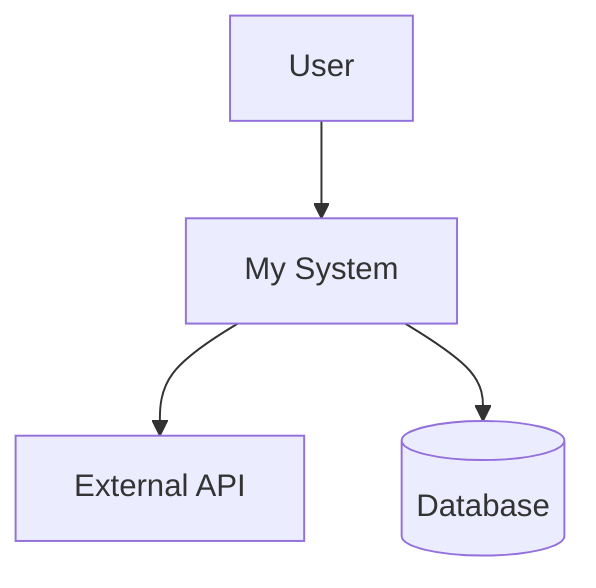
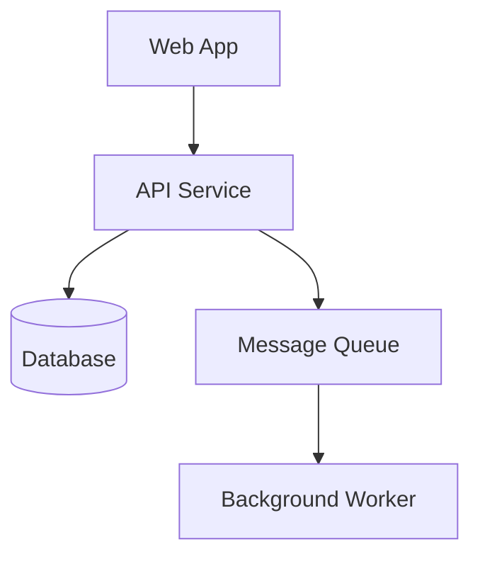
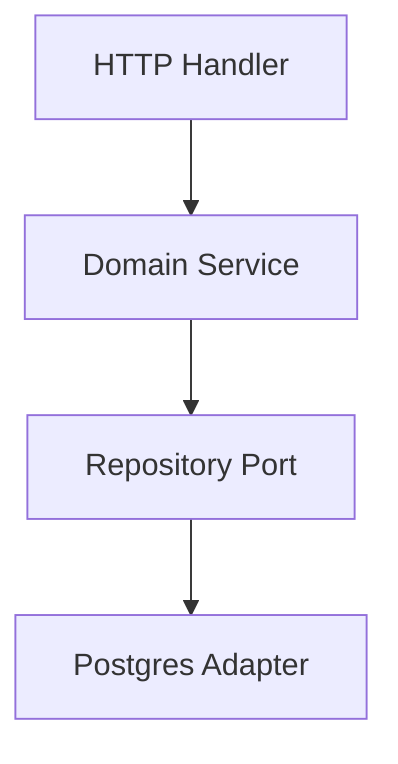

# Software Architecture

## Intro

Architecture is the set of structural decisions that are expensive
to change. Map what exists, name the pattern, check the dependency
directions, and document significant decisions in ADRs. Choose
patterns based on team size, domain complexity, and operational
maturity — not fashion.

## Overview

### Analyzing existing architecture

Before suggesting changes, map the current structure:

1. Identify the top-level module or directory organization.
2. Trace dependency directions (which modules import from which).
3. Classify the current pattern: layered, hexagonal, modular
   monolith, microservices, or ad-hoc.
4. Look for architectural violations such as:
   - Circular dependencies between modules
   - Domain logic leaking into infrastructure (DB queries in handlers)
   - Presentation layer directly accessing the data layer
   - Shared mutable state across boundaries

### Choosing a pattern

Match the pattern to the project. The full pattern catalog is in
`references/patterns.md`.

| Project type | Recommended patterns |
|---|---|
| CLI tool / small utility | Layered or pipe-and-filter |
| REST API / web service | Hexagonal (ports & adapters) or clean architecture |
| Complex business domain | DDD + hexagonal |
| Data processing pipeline | Pipe-and-filter or event-driven |
| Distributed system | Microservices or event-driven |
| Monolith needing structure | Modular monolith with clear boundaries |

Principles that apply across all patterns:

- **Dependency Inversion** — depend on abstractions, not concretions
- **Separation of Concerns** — each module has one reason to change
- **SOLID** — Single Responsibility, Open/Closed, Liskov,
  Interface Segregation, Dependency Inversion
- **DRY** — but prefer duplication over the wrong abstraction
- **KISS** — avoid speculative generality

### Architecture Decision Records

When a significant decision is made, write an ADR:

```markdown
# ADR-NNN: Title

## Status
Proposed | Accepted | Deprecated | Superseded by ADR-XXX

## Context
What forces are at play? What is the problem or opportunity?

## Decision
What is the change we're proposing or have agreed to implement?

## Consequences
What becomes easier or harder? What are the trade-offs?
```

Guidelines: one decision per ADR, numbered sequentially, stored in
`docs/adr/` or `context/decisions/`. Keep context to 3-5 sentences.
List both positive and negative consequences. Link related ADRs.

### Reviewing for violations

Common architectural smells:

- **Layer skipping** — presentation calling the data layer directly
- **Wrong dependency direction** — outer layers being imported by
  inner layers (should be reversed)
- **God modules** — one module with too many responsibilities
- **Leaky abstractions** — implementation details exposed in public
  interfaces
- **Missing boundaries** — no clear separation between domain,
  application, and infrastructure
- **Tight coupling** — concrete types used where interfaces or
  traits should be

### C4 diagrams

Use Mermaid for text-based diagrams at each C4 level. Label every
arrow with the interaction type, briefly describe each element, and
note the technology used.



### Example workflows

- **CLI architecture choice:** layered structure separating
  arg-parsing, business logic, and I/O. Directory proposal plus a
  short ADR documenting the decision.
- **Project architecture review:** map the dependency graph; flag
  controllers importing DB models directly (layer violation);
  introduce a service layer with repository traits; produce a C4
  Level 3 component diagram of the proposed structure.
- **REST -> gRPC ADR:** context (latency, type-safety needs),
  decision (gRPC for internal services, REST for the public API),
  consequences (faster internal calls, added tooling complexity).

## Gotchas

Agent-specific failure modes — provider-neutral pause-and-self-check items:

- **Recommending a pattern before mapping what already exists.** Proposing a hexagonal architecture for an existing codebase without first understanding its actual dependency graph means the recommendation may conflict with structural constraints that are expensive to change. Always trace the current dependency directions and identify the existing (or ad-hoc) pattern before proposing changes.
- **Choosing microservices for a small team or early-stage product.** Microservices require mature DevOps, distributed tracing, service discovery, and the ability to make cross-service deployments safely. A team of 3-5 engineers rarely has this operational maturity. The correct default is a modular monolith with clear boundaries that can be extracted into services later, not a microservice fleet on day one.
- **Layer violations going unaddressed because "it works."** A controller that directly instantiates a database model works but violates layering — when the database changes, the controller breaks. Unchallenged violations compound: the next developer sees the pattern and follows it. Call out layer violations in code review with a concrete alternative.
- **ADRs without negative consequences.** An ADR that records only the reasons to do something is advocacy, not decision documentation. Future engineers reading it don't know what trade-offs were accepted. Every ADR must list both the benefits and the costs of the decision so readers understand what was knowingly accepted.
- **Editing an accepted ADR in place when circumstances change.** An accepted ADR is a historical record of what was decided and why at a point in time. Changing it in place loses that history. When a decision is revisited, supersede the old ADR by writing a new one that references the old decision and documents why the situation has changed.
- **Architectural complexity added speculatively for hypothetical scale.** Event sourcing, CQRS, and message brokers add significant operational complexity. Adding them "in case we need to scale" before you have demonstrated the scaling problem couples the team to complex infrastructure that slows development and introduces failure modes. Add architectural complexity when requirements demand it, not before.
- **Missing dependency direction arrows on architecture diagrams.** A diagram showing boxes connected by lines without arrows leaves the dependency direction ambiguous — you cannot tell whether the domain imports from infrastructure or vice versa, which is the architectural question that matters most. Every arrow in an architecture diagram must have a direction and ideally a label describing the interaction type.

## Full reference

### Pattern catalog

#### Layered (N-Tier)

Horizontal layers (presentation, business, data), each calling only
the layer below. Simple and familiar; prone to the "sinkhole"
anti-pattern where layers just pass data through unchanged. Best for
traditional business apps and legacy migrations.

#### Hexagonal (Ports & Adapters)

Domain at the center, ports (interfaces) and adapters
(implementations) around it. External systems plug in through
adapters. Excellent testability and infrastructure independence at
the cost of more boilerplate. Domain never imports from
infrastructure; infrastructure implements domain-defined ports.

#### Clean Architecture

Concentric rings: Entities, Use Cases, Interface Adapters, Frameworks
& Drivers. Dependencies point inward only. Shares the dependency-
inversion core with hexagonal and onion architectures. Strong
separation of concerns; can feel over-engineered for simple CRUD.

#### Microservices

Small, independently deployable services, each owning its data and
implementing a bounded context. Independent scaling and deployment,
technology diversity — at the cost of significant operational
complexity (service discovery, distributed tracing, data
consistency). Requires mature DevOps.

#### Event-Driven

Components communicate through events. Producers emit without
knowing consumers. Excellent decoupling and scalability; harder to
debug (implicit flows), eventual-consistency challenges, ordering
issues. Variants: event sourcing, CQRS.

#### CQRS

Separate read and write models, potentially in different stores.
Pairs naturally with event sourcing. Use when read and write
workloads differ sharply in scale or complexity.

#### Pipe-and-Filter

Data flows through a chain of filters connected by pipes. Highly
composable; ideal for ETL, compilers, CLI stream processors. Filters
must be independent; not for interactive or stateful work.

#### Modular Monolith

Single deployable unit with strict module boundaries enforced
through interfaces, not direct internal access. Simpler ops than
microservices, clearer than a traditional monolith, and a sensible
stepping stone toward extraction later.

#### Service-Oriented Architecture (SOA)

Reusable services with well-defined contracts, often connected
through an enterprise service bus. Promotes reuse but the ESB can
become a bottleneck and a single point of failure. Heavier
governance than microservices.

#### Serverless / FaaS

Individual functions triggered by events, fully managed by the
provider. Zero infrastructure management and pay-per-execution at
the cost of cold-start latency, vendor lock-in, limited execution
duration, and harder local testing. Best for variable-traffic
event-driven workloads and glue code.

### C4 levels

**Level 1 — System Context** (who uses the system, what external
systems it talks to):


**Level 2 — Container** (deployable units: web app, API, database,
queue):



**Level 3 — Component** (major components within a container):



### Pattern selection checklist

1. **Team size and skill** — smaller teams benefit from simpler
   patterns (layered, modular monolith).
2. **Domain complexity** — complex domains need stronger boundaries
   (hexagonal, clean).
3. **Scale requirements** — high scale favors microservices or
   event-driven.
4. **Deployment frequency** — frequent deploys favor microservices
   or serverless.
5. **Data consistency needs** — strong consistency favors monoliths;
   eventual consistency enables distribution.
6. **Operational maturity** — microservices and event-driven require
   mature DevOps.
7. **Existing codebase** — migrations favor incremental patterns
   (modular monolith as stepping stone).

### ADR tips

- One decision per ADR. Numbered sequentially. Never edit accepted
  ADRs in place — supersede them.
- Keep the context factual: what forces are at play, what
  constraints exist. Avoid editorializing.
- The decision section is short: state what you are doing.
- Consequences must list both wins and costs. An ADR with only
  positives is propaganda, not documentation.
- Link to related ADRs when decisions interact.

### Further reading

- Alistair Cockburn, "Hexagonal Architecture" (2005) —
  https://alistair.cockburn.us/hexagonal-architecture/
- Robert C. Martin, "Clean Architecture" (2017)
- Martin Fowler, "Patterns of Enterprise Application Architecture"
  (2002)
- Sam Newman, "Building Microservices" (2nd ed., 2021)
- Simon Brown, "The C4 Model" — https://c4model.com/
- Michael Nygard, "Documenting Architecture Decisions" (2011)
