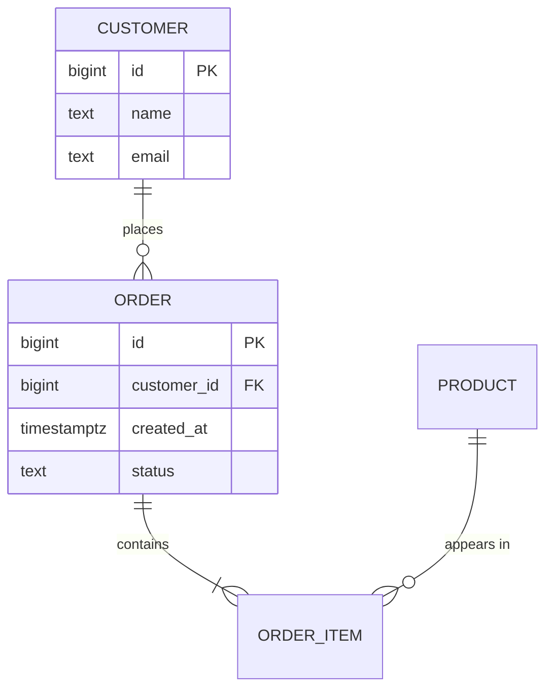

# Database Modeling

## When to Use

When the user asks to:
- Design a database schema for a new feature or project
- Evaluate or critique an existing data model
- Choose between normalized and denormalized designs
- Model complex relationships (polymorphic, hierarchical, temporal)
- Plan schema evolution for a growing system
- Decide between relational and non-relational storage for a specific use case

## Instructions

### 1. Gather Requirements Before Modeling

Before drawing any schema, clarify:

1. **Entities and relationships** — what are the nouns and how do they relate?
2. **Cardinality** — one-to-one, one-to-many, many-to-many?
3. **Access patterns** — what queries will run most often? Read/write ratio?
4. **Data volume** — rows per table now and in 2 years?
5. **Consistency requirements** — which invariants must the database enforce?

### 2. Build the Conceptual Model

Start with an ER diagram (use Mermaid for text-based diagrams):

Notation: `||` = exactly one, `o{` = zero or more, `|{` = one or more.

### 3. Apply Normalization

Normalize to 3NF by default:
- **1NF**: Every column holds a single atomic value. No arrays or comma-separated lists.
- **2NF**: Every non-key column depends on the entire primary key (relevant for composite keys).
- **3NF**: No transitive dependencies — non-key columns depend only on the key.

Test each table: "Does every non-key column describe the key, the whole key, and nothing but the key?"

### 4. Evaluate Denormalization Trade-offs

Denormalize only when you can answer "yes" to all of:
- Have you measured a real performance problem?
- Is the duplicated data updated infrequently?
- Do you have a strategy to keep copies in sync?

Common denormalization techniques:
- **Summary tables** — precomputed aggregates refreshed periodically
- **Embedded lookups** — store `category_name` alongside `category_id` to avoid joins
- **Materialized views** — database-managed denormalization with auto-refresh

### 5. Handle Relationship Patterns

See `references/modeling-patterns.md` for detailed patterns. Summary:

| Pattern | Use When |
|---------|----------|
| Junction table | Many-to-many (standard) |
| Polymorphic associations | One table references multiple parent types |
| Single-table inheritance | Few subtypes, similar columns |
| Class-table inheritance | Many subtypes, different columns |
| Adjacency list | Simple tree, few levels |
| Nested sets | Read-heavy tree, rare updates |
| Materialized path | Tree with path queries |
| JSONB column | Sparse or schema-less attributes |

### 6. Plan Schema Evolution

Schemas change. Design for evolution:

- Add columns as nullable or with defaults — never lock the table
- Prefer additive changes (new columns, new tables) over destructive ones
- Version your API and your schema independently
- Use expand/contract for non-trivial changes:
  1. **Expand** — add new structure alongside old
  2. **Migrate** — backfill data, update application
  3. **Contract** — remove old structure once fully migrated

### 7. Polyglot Persistence Decisions

Not everything belongs in a relational database. Consider:

| Data Type | Storage |
|-----------|---------|
| Structured, relational, transactional | PostgreSQL, MySQL |
| Full-text search | Elasticsearch, PostgreSQL FTS |
| Session/cache data | Redis |
| Time-series metrics | TimescaleDB, InfluxDB |
| Graph traversals | Neo4j, or recursive CTEs for simple cases |
| Unstructured documents | MongoDB, or JSONB in PostgreSQL |
| Event streams | Kafka, or append-only tables |

Default to PostgreSQL unless there is a specific, measured need for a specialized store.

## Examples

**User:** "Design a schema for a multi-tenant SaaS project management app"
**Agent:** Creates an ER diagram with tenants, projects, tasks, users, and team memberships. Uses a `tenant_id` column on every table with row-level security policies. Models task assignments as a junction table to support multiple assignees. Adds a JSONB `metadata` column on tasks for custom fields per tenant. Documents the trade-off of shared-schema multi-tenancy vs. schema-per-tenant.

**User:** "Should I normalize this or keep it flat?"
**Agent:** Examines the proposed flat table, identifies repeating groups (violation of 1NF) and transitive dependencies (violation of 3NF). Proposes a normalized design with three tables, shows the JOIN query that replaces the flat reads, and estimates the performance impact based on the stated data volume. Recommends the normalized design for the transactional workload but suggests a materialized view for the reporting dashboard.

**User:** "How do I model a comment system where comments can belong to posts, images, or videos?"
**Agent:** Presents three options: (1) polymorphic association with `commentable_type` + `commentable_id`, (2) separate junction tables per parent type, (3) shared parent table with class-table inheritance. Recommends option 2 for foreign key integrity, with a view that unions all comment sources for display queries.
