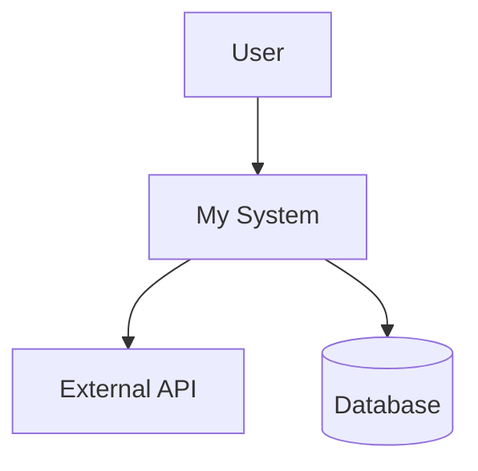
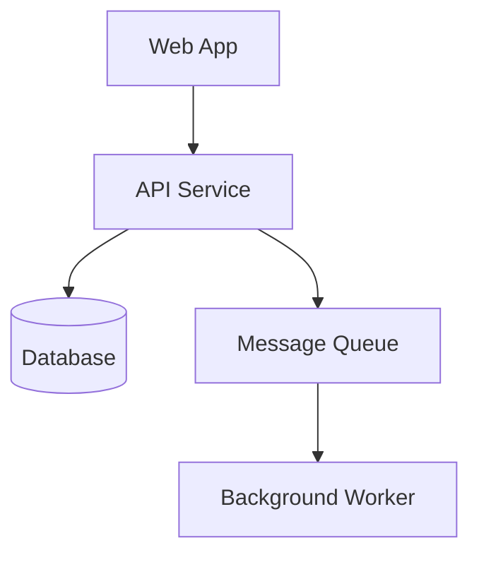
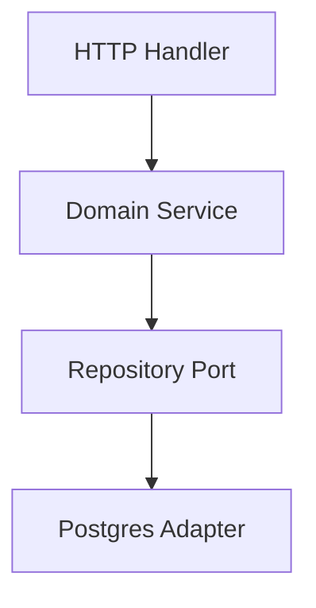

# Software Architecture

## When to Use

When the user asks to:
- Analyze or evaluate a codebase's architecture
- Choose an architecture pattern for a new project or module
- Create an Architecture Decision Record (ADR)
- Review code for architectural violations or drift
- Generate architecture diagrams (C4, dependency graphs)
- Apply SOLID, DRY, or KISS principles at the structural level

## Instructions

### 1. Analyze Existing Architecture

Before suggesting changes, map the current structure:

1. Identify the top-level module/directory organization
2. Trace dependency directions (which modules import from which)
3. Classify the current pattern: layered, hexagonal, modular monolith, microservices, or ad-hoc
4. Look for architectural violations:
   - Circular dependencies between modules
   - Domain logic leaking into infrastructure (DB queries in handlers)
   - Presentation layer directly accessing data layer
   - Shared mutable state across boundaries

### 2. Suggest Patterns Based on Project Type

Match patterns to project characteristics (see `references/patterns.md` for details):

| Project Type | Recommended Patterns |
|---|---|
| CLI tool / small utility | Layered or pipeline |
| REST API / web service | Hexagonal (ports & adapters) or clean architecture |
| Complex business domain | Domain-driven design + hexagonal |
| Data processing pipeline | Pipe-and-filter or event-driven |
| Distributed system | Microservices or event-driven |
| Monolith needing structure | Modular monolith with clear boundaries |

Key principles that apply to all patterns:
- **Dependency Inversion**: depend on abstractions, not concretions
- **Separation of Concerns**: each module has one reason to change
- **SOLID**: Single Responsibility, Open/Closed, Liskov Substitution, Interface Segregation, Dependency Inversion
- **DRY**: Don't Repeat Yourself (but prefer duplication over wrong abstraction)
- **KISS**: Keep It Simple, Stupid (avoid speculative generality)

### 3. Create Architecture Decision Records (ADRs)

When a significant architectural decision is made, create an ADR:

```markdown
# ADR-NNN: Title

## Status
Proposed | Accepted | Deprecated | Superseded by ADR-XXX

## Context
What forces are at play? What is the problem or opportunity?

## Decision
What is the change that we're proposing or have agreed to implement?

## Consequences
What becomes easier or harder? What are the trade-offs?
```

Guidelines:
- One decision per ADR, numbered sequentially
- Store in `docs/adr/` or `context/decisions/` depending on project convention
- Keep context factual and concise (3-5 sentences)
- List both positive and negative consequences
- Link to related ADRs when decisions interact

### 4. Review Code for Architectural Violations

Check for these common violations:

- **Layer skipping**: presentation calling data layer directly
- **Dependency direction**: outer layers importing inner layer types (should be reversed)
- **God modules**: single module with too many responsibilities
- **Leaky abstractions**: implementation details exposed in public interfaces
- **Missing boundaries**: no clear separation between domain, application, and infrastructure
- **Tight coupling**: concrete types used where interfaces/traits should be

### 5. Generate C4 Diagrams

Use Mermaid syntax for text-based diagrams at each C4 level:

**Level 1 - System Context** (who uses the system, what external systems it talks to):


**Level 2 - Container** (deployable units: web app, API, database, queue):


**Level 3 - Component** (major components within a container):


For each diagram: label all arrows with the interaction type, include a brief description of each element, and note the technology used.

## Examples

**User:** "What architecture should I use for this Rust CLI?"
**Agent:** Analyzes the CLI's responsibilities, suggests a layered architecture with clear separation between CLI parsing, business logic, and I/O. Creates a directory structure proposal and an ADR documenting the decision.

**User:** "Review this project's architecture"
**Agent:** Maps the dependency graph, identifies that controllers directly import database models (layer violation), suggests introducing a service layer with repository traits. Provides a C4 Level 3 component diagram of the proposed structure.

**User:** "Create an ADR for switching from REST to gRPC"
**Agent:** Writes an ADR documenting the context (performance requirements, type safety needs), the decision (adopt gRPC for internal services, keep REST for public API), and consequences (faster internal communication, but added complexity in tooling).
